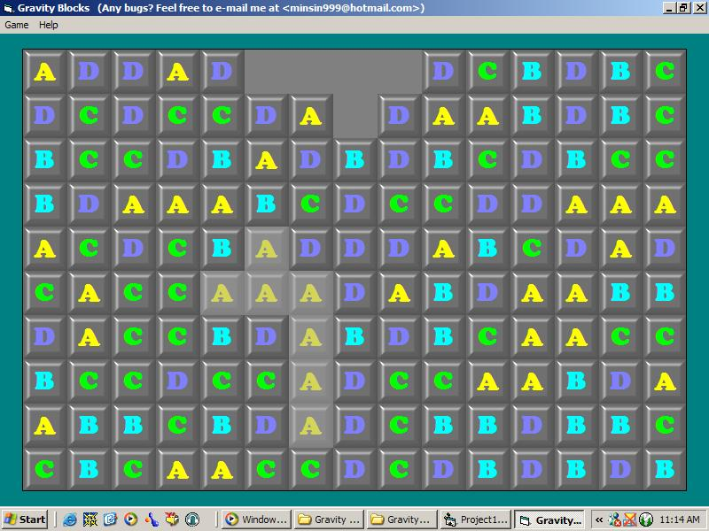



## GravityBlocksWithMove

### Description

This is my old GravityBlocks game with movable blocks feature added. You can move the top blocks when there is no left or right block. I'm still not comfortable with recursion, anyway just try it now!!
 
### More Info
 

             |
---                |---
**Submitted On**   |2003-02-17 11:15:42
**By**             |[Min Thant Sin](https://github.com/Planet-Source-Code/PSCIndex/blob/master/ByAuthor/min-thant-sin.md)
**Level**          |Intermediate
**User Rating**    |5.0 (10 globes from 2 users)
**Compatibility**  |VB 6\.0
**Category**       |[Games](https://github.com/Planet-Source-Code/PSCIndex/blob/master/ByCategory/games__1-38.md)
**World**          |[Visual Basic](https://github.com/Planet-Source-Code/PSCIndex/blob/master/ByWorld/visual-basic.md)
**Archive File**   |[GravityBlo1546022172003\.zip](https://github.com/Planet-Source-Code/min-thant-sin-gravityblockswithmove__1-43301/archive/master.zip)

